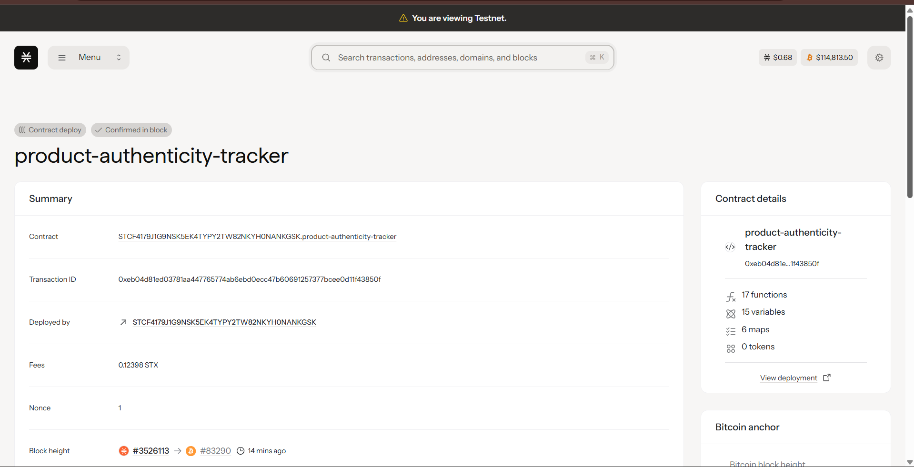

# Product Authenticity Tracker

A comprehensive blockchain-based anti-counterfeiting solution built on Stacks using Clarity smart contracts. This system enables manufacturers to register genuine products and track them throughout the entire supply chain, providing immutable proof of authenticity and complete traceability.

## Contract Address

STCF4179J1G9NSK5EK4TYPY2TW82NKYH0NANKGSK.product-authenticity-tracker



## 🌟 Features

### Core Functionality
- **Product Registration**: Manufacturers can register products with detailed metadata
- **Supply Chain Tracking**: Complete traceability from manufacturing to end consumer
- **Authenticity Verification**: Instant verification of product genuineness
- **Multi-Party Authorization**: Role-based access control for supply chain participants
- **Recall Management**: Efficient product recall system with full traceability
- **Immutable History**: Tamper-proof record of all product movements

### Security & Trust
- **Blockchain Immutability**: Built on Stacks (secured by Bitcoin)
- **Access Control**: Multi-level authorization system
- **Manufacturer Verification**: Only verified manufacturers can register products
- **Supply Chain Integrity**: Authorized verifiers ensure legitimate transfers

## 🏗️ Architecture

### Smart Contract Components

#### Data Structures
- **Manufacturers Registry**: Verified manufacturer information
- **Products Registry**: Complete product catalog with metadata
- **Supply Chain History**: Immutable movement tracking
- **Authorization System**: Role-based access management

#### Status Tracking
1. **Manufactured** - Initial product creation
2. **In Transit** - Product being shipped
3. **Delivered** - Product received at destination
4. **Sold** - Product sold to end consumer
5. **Recalled** - Product recalled due to issues

## 🚀 Getting Started

### Prerequisites

- [Clarinet](https://github.com/hirosystems/clarinet) - Stacks smart contract development tool
- [Node.js](https://nodejs.org/) (v16 or higher)
- [Git](https://git-scm.com/)

### Installation

1. **Clone the repository**
   ```bash
   git clone https://github.com/your-username/product-authenticity-tracker.git
   cd product-authenticity-tracker
   ```

2. **Install Clarinet** (if not already installed)
   ```bash
   # macOS
   brew install clarinet
   
   # Or download from GitHub releases
   # https://github.com/hirosystems/clarinet/releases
   ```

3. **Verify installation**
   ```bash
   clarinet --version
   ```

### Project Structure

```
product-authenticity-tracker/
├── contracts/
│   └── product-authenticity-tracker.clar    # Main smart contract
├── tests/
│   └── product-authenticity-tracker.test.ts # Contract tests
├── settings/
│   ├── Devnet.toml                          # Development network config
│   ├── Testnet.toml                         # Testnet deployment config
│   └── Mainnet.toml                         # Mainnet deployment config
├── Clarinet.toml                            # Project configuration
└── README.md                                # This file
```

## 🔧 Development

### Running the Development Environment

1. **Start Clarinet console**
   ```bash
   clarinet console
   ```

2. **Check contract syntax**
   ```bash
   clarinet check
   ```

3. **Run tests**
   ```bash
   clarinet test
   ```

### Contract Interaction Examples

#### Register a Manufacturer (Contract Owner Only)
```clarity
(contract-call? .product-authenticity-tracker register-manufacturer 
  "Apple Inc." 
  'SP2J6ZY48GV1EZ5V2V5RB9MP66SW86PYKKNRV9EJ7)
```

#### Register a Product (Manufacturer Only)
```clarity
(contract-call? .product-authenticity-tracker register-product
  "iPhone 15 Pro"
  "A3101"
  "F9K2L3M4N5P6"
  "BATCH-2024-001"
  (some "https://metadata.example.com/iphone15pro"))
```

#### Transfer Product in Supply Chain
```clarity
(contract-call? .product-authenticity-tracker transfer-product
  u1                                    ; product-id
  'SP1K7A8A9Z2B3C4D5E6F7G8H9I0J1K2L3M  ; to-address
  u2                                    ; STATUS-IN-TRANSIT
  "Shipping Facility - New York"
  (some "Shipped via FedEx"))
```

#### Verify Product Authenticity
```clarity
(contract-call? .product-authenticity-tracker verify-authenticity u1)
```

## 📋 API Reference

### Public Functions

#### Administrative Functions

| Function | Parameters | Description | Access |
|----------|------------|-------------|---------|
| `register-manufacturer` | `name`, `manufacturer-address` | Register a new verified manufacturer | Contract Owner |
| `authorize-verifier` | `verifier`, `name`, `role` | Authorize supply chain verifier | Contract Owner |
| `revoke-verifier` | `verifier` | Revoke verifier authorization | Contract Owner |

#### Core Functions

| Function | Parameters | Description | Access |
|----------|------------|-------------|---------|
| `register-product` | `product-name`, `model`, `serial-number`, `batch-number`, `metadata-uri` | Register new product | Manufacturers |
| `transfer-product` | `product-id`, `to-address`, `new-status`, `location`, `notes` | Transfer product ownership | Current Holder / Verifiers |
| `recall-product` | `product-id`, `reason` | Mark product as recalled | Manufacturer / Verifiers |

### Read-Only Functions

| Function | Parameters | Returns | Description |
|----------|------------|---------|-------------|
| `get-product` | `product-id` | Product details | Get complete product information |
| `get-manufacturer` | `manufacturer-id` | Manufacturer details | Get manufacturer information |
| `verify-authenticity` | `product-id` | Authenticity status | Verify if product is genuine |
| `get-product-history` | `product-id`, `sequence` | History entry | Get specific movement record |
| `is-authorized-verifier` | `address` | Boolean | Check if address is authorized verifier |

## 🧪 Testing

### Running Tests

```bash
# Run all tests
clarinet test

# Run specific test file
clarinet test tests/product-authenticity-tracker.test.ts

# Run tests with coverage
clarinet test --coverage
```

### Test Categories

1. **Manufacturer Management Tests**
   - Register manufacturers
   - Duplicate registration prevention
   - Authorization checks

2. **Product Registration Tests**
   - Valid product creation
   - Input validation
   - Manufacturer verification

3. **Supply Chain Tests**
   - Product transfers
   - Status transitions
   - Authorization verification

4. **Authenticity Verification Tests**
   - Genuine product verification
   - Counterfeit detection
   - History tracking

## 🌐 Deployment

### Local Development
```bash
# Start local blockchain
clarinet integrate

# Deploy to local devnet
clarinet deploy --devnet
```

### Testnet Deployment
```bash
# Configure testnet settings in settings/Testnet.toml
clarinet deploy --testnet
```

### Mainnet Deployment
```bash
# Configure mainnet settings in settings/Mainnet.toml
clarinet deploy --mainnet
```

## 🔍 Use Cases

### Supply Chain Participants

1. **Manufacturers**
   - Register authentic products
   - Track production batches
   - Initiate recalls when necessary

2. **Distributors/Wholesalers**
   - Receive and verify products
   - Update location and status
   - Transfer to retailers

3. **Retailers**
   - Verify product authenticity
   - Update final sale status
   - Provide proof to consumers

4. **Consumers**
   - Verify product authenticity
   - Access complete product history
   - Report counterfeit products

### Industry Applications

- **Luxury Goods**: Prevent counterfeiting of high-value items
- **Pharmaceuticals**: Ensure drug authenticity and safety
- **Electronics**: Combat fake components and devices
- **Fashion**: Protect brand integrity and intellectual property
- **Automotive**: Track genuine parts and components

## 🛡️ Security Considerations

### Access Control
- Contract owner has administrative privileges
- Manufacturers can only register their own products
- Verifiers can update status but not ownership
- All actions are logged and immutable

### Data Validation
- Input sanitization for all user-provided data
- Status transition validation
- Ownership verification before transfers
- Manufacturer verification requirements

### Blockchain Security
- Built on Stacks (secured by Bitcoin's proof-of-work)
- Smart contract immutability after deployment
- Cryptographic verification of all transactions

## 🤝 Contributing

### Development Workflow

1. **Fork the repository**
2. **Create feature branch**
   ```bash
   git checkout -b feature/amazing-feature
   ```
3. **Make changes and test**
   ```bash
   clarinet check
   clarinet test
   ```
4. **Commit changes**
   ```bash
   git commit -m 'Add amazing feature'
   ```
5. **Push to branch**
   ```bash
   git push origin feature/amazing-feature
   ```
6. **Open Pull Request**

### Code Standards
- Follow Clarity best practices
- Include comprehensive tests
- Document all public functions
- Use meaningful variable names
- Add comments for complex logic

## 📄 License

This project is licensed under the MIT License - see the [LICENSE](LICENSE) file for details.

## 🆘 Support

### Documentation
- [Stacks Documentation](https://docs.stacks.co/)
- [Clarity Language Reference](https://docs.stacks.co/docs/clarity/)
- [Clarinet Documentation](https://docs.hiro.so/clarinet/)

### Community
- [Stacks Discord](https://discord.gg/stacks)
- [GitHub Issues](https://github.com/your-username/product-authenticity-tracker/issues)
- [Stack Overflow](https://stackoverflow.com/questions/tagged/stacks-blockchain)

### Getting Help

If you encounter any issues or have questions:

1. Check the [FAQ section](#faq)
2. Search existing [GitHub Issues](https://github.com/your-username/product-authenticity-tracker/issues)
3. Join our community discussions
4. Create a new issue with detailed information

## ❓ FAQ

**Q: How do I become a registered manufacturer?**
A: Contact the contract owner to be added as a verified manufacturer. This requires providing business verification documents.

**Q: Can I track products I didn't manufacture?**
A: No, only the original manufacturer and authorized verifiers can update product status and ownership.

**Q: What happens if a product is recalled?**
A: The recall status is permanently recorded on the blockchain, and the complete history shows when and why the recall occurred.

**Q: How can consumers verify authenticity?**
A: Consumers can use the product ID (typically from QR code or NFC tag) to check authenticity through any application that interfaces with the smart contract.

**Q: Is product data private?**
A: Basic product information is publicly verifiable for authenticity, but sensitive business data can be stored off-chain with only hashes stored on-chain.

---

## 🎯 Roadmap

### Phase 1 (Current)
- ✅ Core smart contract implementation
- ✅ Basic manufacturer and product registration
- ✅ Supply chain tracking
- ✅ Authenticity verification

### Phase 2 (Next)
- 🔄 Frontend web application
- 🔄 Mobile app for consumers
- 🔄 QR code/NFC integration
- 🔄 API documentation and SDKs

### Phase 3 (Future)
- ⏳ Integration with IoT devices
- ⏳ Advanced analytics and reporting
- ⏳ Multi-chain compatibility
- ⏳ Enterprise integrations

---

**Built with ❤️ for supply chain transparency and consumer protection**
